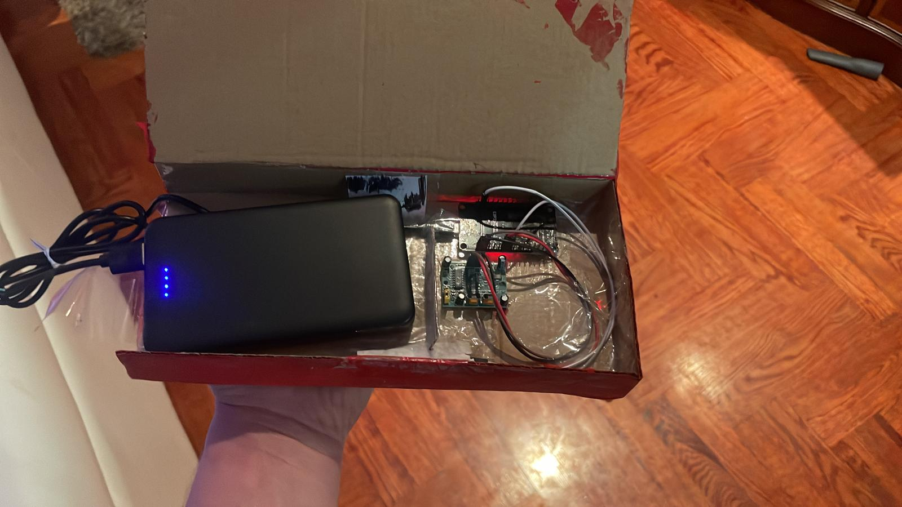
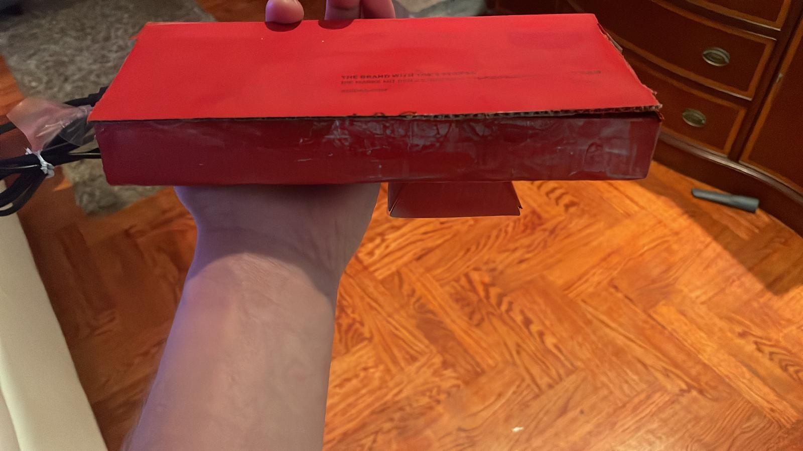

# ESP32 Smart Door Alarm

An IoT smart door monitoring system built with **ESP32, PIR motion sensor, Firebase Realtime Database and a web dashboard**.

The system detects motion near a door, activates a buzzer alarm, and logs motion events to a real-time web interface.

This project was developed as part of a **university IoT course project**.

---

# Project Overview

The device is designed to be **mounted to the underside of a door frame**.  
When someone walks through the door, the PIR motion sensor detects movement and triggers the alarm system.

The ESP32 then:

1. Activates a buzzer alarm
2. Sends the motion event to Firebase Realtime Database
3. The web dashboard instantly displays the event

The device runs on a **portable USB power bank located inside the device casing**, making it easy to install without permanent wiring.

---

# Hardware Components

The device is built using the following components:

- **ESP32 microcontroller**
- **PIR motion sensor**
- **Active buzzer**
- **USB power bank**
- **Jumper wires**
- **Device casing / enclosure**

The hardware is mounted inside a small casing that can be attached to the **underside of a door frame**.

---

# System Architecture

The system consists of three main parts:

### 1. ESP32 Device

Responsible for:

- reading PIR sensor input
- triggering the buzzer alarm
- sending motion events to Firebase
- sending periodic heartbeat signals

---

### 2. Firebase Backend

Firebase is used for:

- **Realtime Database** – storing motion events and device status
- **Cloud Functions** – sending push notifications
- **Firebase Hosting** – hosting the web dashboard

---

### 3. Web Dashboard

The web application displays:

- device status (ONLINE / OFFLINE)
- list of detected motion events
- real-time updates from Firebase

The dashboard is hosted using **Firebase Hosting**.

---

# How It Works

1. The ESP32 connects to WiFi.
2. It establishes communication with Firebase Realtime Database.
3. The system enters **Monitoring Mode**.
4. When the PIR sensor detects motion:
   - the buzzer activates
   - a motion event is written to Firebase
5. The web dashboard listens for database updates and displays the event instantly.
6. A **cooldown period** prevents multiple alarms from triggering rapidly.

---

# ESP32 Code

The ESP32 firmware was developed using **Arduino IDE** and uses the following libraries:

- WiFi
- WiFiClientSecure
- HTTPClient

The firmware handles:

- sensor monitoring
- alarm activation
- Firebase communication
- heartbeat signals

---

# Web Dashboard

The web dashboard is built using:

- HTML
- JavaScript
- Firebase SDK

It connects to Firebase Realtime Database and updates the interface whenever new events occur.

---

# Installation

### 1. ESP32 Setup

Upload the Arduino firmware to the ESP32.

Update these values in the code:
const char* ssid = "YOUR_WIFI";
const char* password = "YOUR_PASSWORD";

---

### 2. Firebase Setup

Create a Firebase project and enable:

- Realtime Database
- Firebase Hosting
- Cloud Functions (optional)

Deploy using:
firebase deploy

